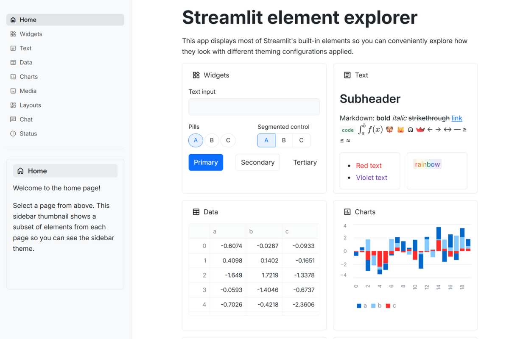

# 💙 Bootstrap-Inspired Theme

**The web framework every developer knows and loves - now for Streamlit!**

Instantly familiar, professionally trusted, and universally recognized. This theme brings Bootstrap's signature aesthetic to your Streamlit apps, making them feel like real web applications! 🌐✨



## 🔥 What Makes This Theme Special

Bootstrap is the most popular CSS framework for a reason - and now your Streamlit apps can capture that same trusted aesthetic:

**🔵 Signature Bootstrap Blue** (#0d6efd) - THE color every developer recognizes  
**📱 System-Like Feel** - Clean, familiar, professional web app aesthetic  
**⚙️ Perfect Border Radius** (0.375rem) - Bootstrap's exact default  
**📊 Classic Gray Scale** - Bootstrap's signature gray palette (#f8f9fa, #e9ecef)  
**🎯 Familiar Typography** - Inter font for that modern web feel  
**🧩 Component-Ready** - Looks like it's built with Bootstrap components

## 🎯 Perfect For

- **Internal business tools** and dashboards
- **Admin panels** and management interfaces
- **Data analysis platforms** that need credibility
- **Customer support tools** and CRM systems
- **Developer tools** and monitoring dashboards
- **Any app that needs** to feel "professionally familiar"
- **Enterprise applications** that require instant trust
- **Educational platforms** and learning management systems

## 🚀 Quick Start

```bash
# Clone the entire repo to see all themes
git clone https://github.com/jmedia65/awesome-streamlit-themes.git
cd awesome-streamlit-themes/bootstrap

# Install dependencies and see the theme in action
pip install -r requirements.txt
streamlit run streamlit_app.py
```

**Love what you see?** Copy the theme to your project:

```bash
# Copy theme files to your Streamlit project
cp -r .streamlit/ /path/to/your/project/
cp -r static/ /path/to/your/project/
```

## 🛠️ Fonts Used

_All fonts are already included in the `static/` folder - no downloads needed!_

### Inter (Modern Bootstrap's Choice)

- **Perfect for:** Clean, web-optimized typography used by modern Bootstrap sites
- **Used for:** Body text, headings, interface elements
- **Source:** [Google Fonts - Inter](https://fonts.google.com/specimen/Inter)

### JetBrains Mono (Developer Favorite)

- **Perfect for:** Clean, modern monospace that developers love
- **Used for:** Code snippets, monospace text
- **Source:** [Google Fonts - JetBrains Mono](https://fonts.google.com/specimen/JetBrains+Mono)

## 📁 Installation Steps

1. **Clone and explore** the theme first (see Quick Start above)
2. **Copy theme files** to your own Streamlit project:
   ```
   your-project/
   ├── .streamlit/
   │   └── config.toml          # ← Copy this!
   ├── static/                  # ← Copy this entire folder!
   │   ├── Inter_18pt-Regular.ttf
   │   ├── Inter_18pt-Medium.ttf
   │   ├── Inter_18pt-SemiBold.ttf
   │   ├── Inter_18pt-Bold.ttf
   │   ├── JetBrainsMono-Regular.ttf
   │   └── JetBrainsMono-Medium.ttf
   └── your_app.py
   ```
3. **Restart your Streamlit app** and enjoy the Bootstrap familiarity!

## 🎨 Theme Configuration

The magic happens in `.streamlit/config.toml`:

```toml
[theme]
primaryColor = "#0d6efd"              # Bootstrap 5's signature blue
backgroundColor = "#ffffff"           # Pure white - Bootstrap's foundation
secondaryBackgroundColor = "#f8f9fa"  # Bootstrap's gray-50
textColor = "#212529"                 # Bootstrap's body text color
linkColor = "#0d6efd"                 # Bootstrap primary for links
borderColor = "#dee2e6"               # Bootstrap's border-color
```

## 🏆 The Developer Recognition Factor

Every developer will look at this and think: "This looks like a professional web application." It has that instant credibility of Bootstrap's design system - systematic, clean, and trustworthy.

It's like putting your Streamlit app in a perfectly tailored Bootstrap suit! 👔

This theme bridges the gap between "obviously Streamlit" and "looks like a real web app" better than any other approach. Pure developer comfort zone!

## 💡 Why Bootstrap Styling Works

✅ **Instant Credibility** - Users trust interfaces that look familiar  
✅ **Professional Polish** - Systematic design that feels intentional  
✅ **Developer Comfort** - Every web developer has used Bootstrap  
✅ **Enterprise Ready** - Safe choice for business applications  
✅ **Responsive Feel** - Looks great on any screen size  
✅ **Timeless Design** - Won't look outdated next year

## 🎯 Pro Tips

- **Perfect for client presentations** - familiar = trustworthy
- **Great for internal tools** that need quick adoption
- **Ideal for data dashboards** that business users will access
- **Excellent for prototypes** that need to feel "real"

---

**Built with 💙 for developers who love familiar, reliable design**  
_Bringing Bootstrap's trusted aesthetic to the Streamlit world_ 🚀
