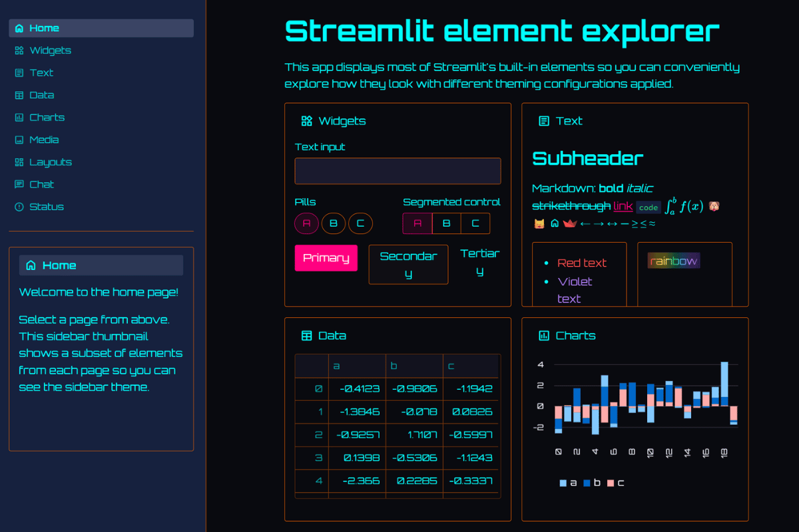

# 🌆 Cyberpunk Theme

**Your Python app just time-traveled to 1985 and it's LIVING FOR THIS VIBE!**

When your data needs that retro-future aesthetic and your dashboards deserve to look like they belong in Blade Runner. Perfect for developers who want their analytics to feel like hacker terminals from the movies! ⚡🎮



## 🔥 What Makes This Theme ELECTRIC

This theme captures the pure essence of 80s cyberpunk aesthetics that every developer secretly loves:

**🌸 Hot Pink Primary** (#ff0080) - That classic synthwave magenta that screams "I'm from the future"  
**🖤 Deep Space Background** (#0a0a0f) - Dark purple-black like a synthwave album cover  
**💙 Neon Cyan Text** (#00ffff) - That retro computer terminal green-blue magic  
**🧡 Electric Orange Borders** (#ff6b00) - Because neon everything!  
**🤖 Orbitron Typography** - Gives serious Blade Runner vibes  
**⚡ Sharp Corners** - Angular, not rounded (very 80s aesthetic)

## 🎯 Perfect For

- **Late-night coding sessions** and developer tools that need personality
- **Gaming analytics** and esports performance dashboards
- **Creative agency** portfolios and digital art analytics
- **Music production** analytics and DJ performance tracking
- **Security monitoring** tools (because hackers love cyberpunk)
- **Creative experiments** and prototype demonstrations
- **Team hackathons** and internal fun projects
- **Any app that needs** to break free from corporate gray!

## 🚀 Quick Start

```bash
# Clone the entire repo to see all themes
git clone https://github.com/jmedia65/awesome-streamlit-themes.git
cd awesome-streamlit-themes

# Install dependencies
pip install -r requirements.txt

# Navigate to cyberpunk theme and see it in action
cd cyberpunk
streamlit run streamlit_app.py
```

**Ready to go full neon?** Copy the theme to your project:

```bash
# Copy theme files to your Streamlit project
cp -r .streamlit/ /path/to/your/project/
cp -r static/ /path/to/your/project/
```

## 🛠️ Fonts Used

_All fonts are already included in the `static/` folder - no downloads needed!_

### Orbitron (The Sci-Fi Legend)

- **Perfect for:** Futuristic interfaces that belong in space stations and cyberpunk cities
- **Used for:** Headings, interface elements, that "I'm in the matrix" feeling
- **Source:** [Google Fonts - Orbitron](https://fonts.google.com/specimen/Orbitron)

### Source Code Pro (Terminal Vibes)

- **Perfect for:** Clean, professional monospace that feels like elite hacker terminals
- **Used for:** Code snippets, data tables, technical readouts
- **Source:** [Google Fonts - Source Code Pro](https://fonts.google.com/specimen/Source+Code+Pro)

## 📁 Installation Steps

1. **Clone and explore** the theme first (see Quick Start above)
2. **Copy theme files** to your own Streamlit project:
   ```
   your-project/
   ├── .streamlit/
   │   └── config.toml          # ← Copy this cyberpunk magic!
   ├── static/                  # ← Copy this entire neon folder!
   │   ├── Orbitron-Regular.ttf
   │   ├── Orbitron-Medium.ttf
   │   ├── Orbitron-SemiBold.ttf
   │   ├── Orbitron-Bold.ttf
   │   ├── Orbitron-ExtraBold.ttf
   │   ├── SourceCodePro-Regular.ttf
   │   └── SourceCodePro-Bold.ttf
   └── your_app.py
   ```
3. **Restart your Streamlit app** and welcome to the future!

## 🎨 Theme Configuration

The neon magic happens in `.streamlit/config.toml`:

```toml
[theme]
primaryColor = "#ff0080"              # Hot pink/magenta - classic synthwave
backgroundColor = "#0a0a0f"           # Deep dark purple-black
secondaryBackgroundColor = "#1a1a2e"  # Dark navy with purple tint
textColor = "#00ffff"                 # Cyan - that retro computer blue
linkColor = "#ff0080"                 # Hot pink for links
borderColor = "#ff6b00"               # Electric orange borders
```

## 🏆 The "Holy Grail of Themes" Factor

This theme turns any boring business dashboard into something that looks like it belongs in a cyberpunk movie. Your users will feel like elite hackers accessing secret government databases (in the best possible way).

Perfect for:

- **Demonstrating technical prowess** - shows you have style AND skills
- **Creative projects** - when your analytics need personality
- **Developer tools** - because coding should be fun
- **Breaking corporate monotony** - inject some personality into internal tools

## 💡 Why Cyberpunk Works (Seriously!)

✅ **Nostalgia Factor** - 80s aesthetics are having a moment  
✅ **High Contrast** - Actually improves readability in dark environments  
✅ **Developer Appeal** - Taps into sci-fi and gaming culture  
✅ **Memorable** - Your app will be the one people remember  
✅ **Energy Boost** - Neon colors genuinely make interfaces feel more alive  
✅ **Conversation Starter** - Great for demos and presentations

## 🎯 Pro Tips

- **Perfect for developer demos** - guaranteed to get attention and smiles
- **Great for creative agencies** - shows you understand visual impact
- **Ideal for gaming industry** - speaks the language of your audience
- **Excellent for hackathons** - stands out from the corporate crowd

## 🎮 Developer Culture Approved

This aesthetic resonates with:

- Developers who grew up playing retro games
- Teams that appreciate 80s nostalgia and synthwave culture
- Creative professionals in gaming, music, and digital art
- Anyone who thinks corporate gray is the enemy of creativity
- Late-night coders who want their terminals to have personality

## ⚠️ Use Responsibly

**Warning:** This theme may cause:

- Sudden urges to listen to synthwave music while coding
- Irresistible desire to create more neon-themed applications
- Colleagues asking "Wait, is that really Streamlit?!"
- Productivity increases due to pure visual excitement

---

**Built with 🌆 for developers who refuse to accept boring**  
_Because sometimes your data deserves to look like it's from the future_ ⚡
