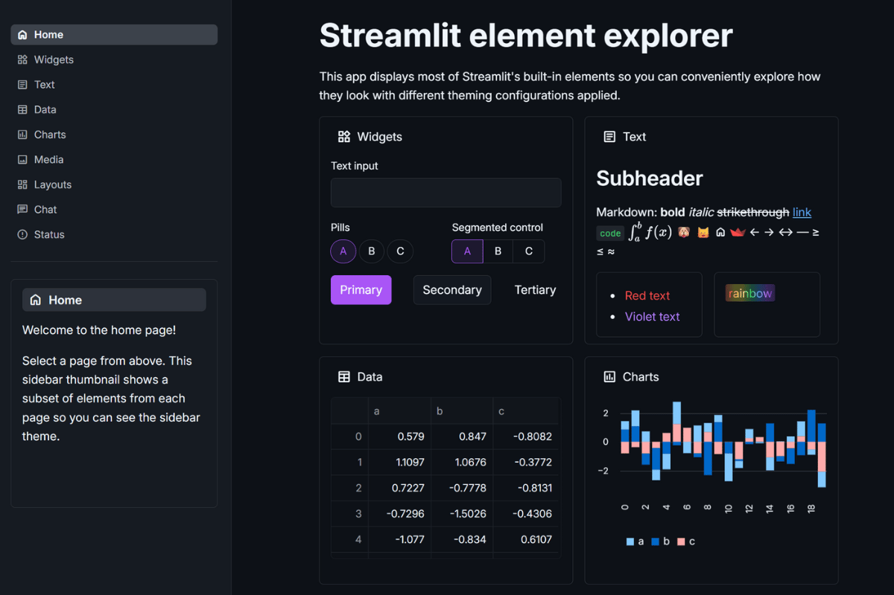

# 🌙 Dark Mode Developer Theme

**The ultimate late-night coding companion for Streamlit apps!**

Perfect for developer tools, monitoring dashboards, and any app that needs that professional "I belong in VS Code" aesthetic. Your eyes will thank you! 👀✨



## 🔥 What Makes This Theme Special

This theme captures the exact visual comfort of your favorite development environment:

**🖤 GitHub Dark Background** (#0d1117) - The exact color developers stare at for hours  
**💜 Purple Accent** (#a855f7) - Modern, vibrant, code-like energy  
**👁️ Eye-Friendly Text** (#f0f6fc) - Perfect contrast for late-night sessions  
**🔗 GitHub Blue Links** (#58a6ff) - Instantly familiar navigation  
**⚡ JetBrains Mono Code** - Ligatures, perfect spacing, developer bliss  
**🎯 VS Code Vibes** - Sidebar colors that feel like home

## 🎯 Perfect For

- **Internal developer tools** and dashboards
- **CI/CD monitoring** platforms
- **Code analysis** and metrics
- **API documentation** and testing
- **Database query** interfaces
- **Server monitoring** dashboards
- **DevOps operational** tools
- **Technical documentation** sites

## 🚀 Quick Start

```bash
# Clone the entire repo to see all themes
git clone https://github.com/jmedia65/awesome-streamlit-themes.git
cd awesome-streamlit-themes

# Install dependencies
pip install -r requirements.txt

# Navigate to dark-mode theme and see it in action
cd dark-mode
streamlit run streamlit_app.py
```

**Love what you see?** Copy the theme to your project:

```bash
# Copy theme files to your Streamlit project
cp -r .streamlit/ /path/to/your/project/
cp -r static/ /path/to/your/project/
```

## 🛠️ Fonts Used

_All fonts are already included in the `static/` folder - no downloads needed!_

### Inter (Developer UI Standard)

- **Perfect for:** Clean, modern UI text used by GitHub, Figma, and top developer tools
- **Used for:** Body text, headings, interface elements
- **Source:** [Google Fonts - Inter](https://fonts.google.com/specimen/Inter)

### JetBrains Mono (Developer's Holy Grail)

- **Perfect for:** Code blocks with ligatures and perfect spacing
- **Used for:** Code snippets, monospace text
- **Source:** [Google Fonts - JetBrains Mono](https://fonts.google.com/specimen/JetBrains+Mono)

## 📁 Installation Steps

1. **Clone and explore** the theme first (see Quick Start above)
2. **Copy theme files** to your own Streamlit project:
   ```
   your-project/
   ├── .streamlit/
   │   └── config.toml          # ← Copy this!
   ├── static/                  # ← Copy this entire folder!
   │   ├── Inter_18pt-Regular.ttf
   │   ├── Inter_18pt-Medium.ttf
   │   ├── Inter_18pt-SemiBold.ttf
   │   ├── Inter_18pt-Bold.ttf
   │   ├── JetBrainsMono-Regular.ttf
   │   ├── JetBrainsMono-Medium.ttf
   │   └── JetBrainsMono-Bold.ttf
   └── your_app.py
   ```
3. **Restart your Streamlit app** and enjoy the developer paradise!

## 🎨 Theme Configuration

The magic happens in `.streamlit/config.toml`:

```toml
[theme]
primaryColor = "#a855f7"              # Purple-500 - vibrant, code-like accent
backgroundColor = "#0d1117"           # GitHub dark background
secondaryBackgroundColor = "#161b22"  # Slightly lighter - cards and sections
textColor = "#f0f6fc"                 # Light blue-white - easy on eyes
linkColor = "#58a6ff"                 # GitHub blue - familiar developer color
borderColor = "#30363d"               # Dark gray borders
```

## 🏆 The Developer Recognition Factor

Every developer will look at this and immediately think: "This looks like professional developer tooling." It has that instant credibility of GitHub, VS Code, and Cursor combined!

Your dev team will actually **WANT** to use internal tools that look this good! No more "ugh, another ugly internal dashboard" - this makes Streamlit apps feel like premium developer software.

**Bonus:** Perfect for late-night coding sessions without burning your retinas! 👀✨

## 💡 Pro Tips

- **Use with dark themes** in your IDE for consistent experience
- **Perfect for technical audiences** who live in dark mode
- **Great for data that benefits** from high contrast
- **Ideal for monitoring dashboards** that run 24/7

---

**Built with 🖤 for developers who code in the dark**  
_Making late-night debugging sessions a little more beautiful_ 🌙
