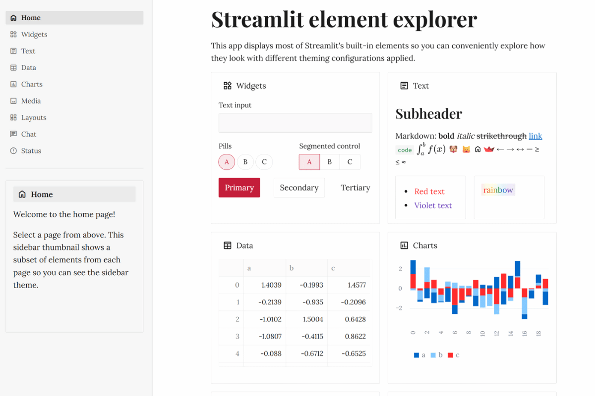

# 📰 Editorial Theme

**Professional publishing design for content-focused applications!**

When your data tells a story and readability matters most, this theme delivers the editorial excellence of The New York Times meets The Guardian. Clean, authoritative, and built for content - perfect for journalism, research, and publishing platforms! ✍️✨



## 🔥 What Makes This Theme Special

This theme captures the timeless professionalism and readability of the world's leading publications:

**🔴 Editorial Red Primary** (#c41e3a) - That classic "breaking news" urgency and authority  
**📖 Serif Body Text** - Lora for maximum readability in long-form content  
**📰 Elegant Headlines** - Playfair Display for dramatic, newspaper-style headers  
**⚫ High Contrast Text** - Near-black for professional readability standards  
**📏 Minimal Rounding** - Timeless, classic aesthetic that never goes out of style  
**🔗 Editorial Blue Links** - Trustworthy, professional navigation

## 🎯 Perfect For

- **Content management systems** and editorial workflows
- **News aggregation platforms** and media monitoring
- **Publishing analytics** and article performance tracking
- **Journalism research tools** and fact-checking platforms
- **Editorial dashboards** and newsroom management
- **Academic publishing** and research paper analysis
- **Social media monitoring** for news organizations
- **Content strategy platforms** and SEO analysis tools

## 🚀 Quick Start

```bash
# Clone the entire repo to see all themes
git clone https://github.com/jmedia65/awesome-streamlit-themes.git
cd awesome-streamlit-themes/editorial

# Install dependencies and see the theme in action
pip install -r requirements.txt
streamlit run streamlit_app.py
```

**Love what you see?** Copy the theme to your project:

```bash
# Copy theme files to your Streamlit project
cp -r .streamlit/ /path/to/your/project/
cp -r static/ /path/to/your/project/
```

## 🛠️ Fonts Used

_All fonts are already included in the `static/` folder - no downloads needed!_

### Playfair Display (Editorial Headlines)

- **Perfect for:** Elegant, dramatic headlines with high-contrast serif elegance
- **Used for:** Headings, titles, attention-grabbing headers
- **Source:** [Google Fonts - Playfair Display](https://fonts.google.com/specimen/Playfair+Display)

### Lora (Editorial Body Text)

- **Perfect for:** Highly readable serif designed specifically for editorial content
- **Used for:** Body text, articles, long-form content
- **Source:** [Google Fonts - Lora](https://fonts.google.com/specimen/Lora)

### Source Code Pro (Editorial Code)

- **Perfect for:** Clean, professional monospace for data and code
- **Used for:** Code snippets, data tables, technical content
- **Source:** [Google Fonts - Source Code Pro](https://fonts.google.com/specimen/Source+Code+Pro)

## 📁 Installation Steps

1. **Clone and explore** the theme first (see Quick Start above)
2. **Copy theme files** to your own Streamlit project:
   ```
   your-project/
   ├── .streamlit/
   │   └── config.toml          # ← Copy this!
   ├── static/                  # ← Copy this entire folder!
   │   ├── PlayfairDisplay-Regular.ttf
   │   ├── PlayfairDisplay-SemiBold.ttf
   │   ├── PlayfairDisplay-Bold.ttf
   │   ├── Lora-Regular.ttf
   │   ├── Lora-Medium.ttf
   │   ├── Lora-SemiBold.ttf
   │   ├── Lora-Bold.ttf
   │   └── SourceCodePro-Regular.ttf
   └── your_app.py
   ```
3. **Restart your Streamlit app** and enjoy the editorial excellence!

## 🎨 Theme Configuration

The magic happens in `.streamlit/config.toml`:

```toml
[theme]
primaryColor = "#c41e3a"              # Editorial red - breaking news, attention
backgroundColor = "#ffffff"           # Pure white - classic newspaper background
secondaryBackgroundColor = "#f9f9f9"  # Off-white - subtle article sections
textColor = "#1a1a1a"                 # Near-black - maximum readability
linkColor = "#0066cc"                 # Editorial blue - trustworthy links
borderColor = "#e0e0e0"               # Light gray - clean article separation
```

## 🏆 The Publishing Professional Standard

This theme creates that instant credibility you see in major news organizations. It's designed for reading, analyzing, and presenting information with the same visual authority as The Washington Post, BBC News, or The Atlantic.

Perfect typography hierarchy for content-heavy applications, with the classic serif elegance that makes information digestible and authoritative!

Perfect for:

- **Editorial workflows** - Familiar to journalists and content creators
- **Publishing analytics** - Clean presentation of content metrics
- **Research platforms** - Academic credibility and readability
- **Content strategy** - Professional presentation of media insights

## 💡 Why Editorial Design Works

✅ **Instant Authority** - Editorial red commands attention and respect  
✅ **Maximum Readability** - Serif typography optimized for content consumption  
✅ **Professional Hierarchy** - Clear distinction between headlines and body text  
✅ **Timeless Appeal** - Classic newspaper aesthetic that never dates  
✅ **Content Focus** - Design that enhances rather than distracts from information  
✅ **Trust Building** - Visual language of respected news organizations

## 🎯 Pro Tips

- **Perfect for content-heavy dashboards** - excellent readability for long sessions
- **Great for research presentations** - academic credibility with editorial polish
- **Ideal for storytelling with data** - supports narrative-driven analysis
- **Excellent for client reports** - professional publishing-grade appearance

## 📺 Editorial Industry Approved

This design approach is trusted by:

- Major newspapers and news organizations
- Academic journals and research institutions
- Publishing houses and media companies
- Content marketing agencies
- Digital magazine platforms

---

**Built with 📰 for stories that matter**  
_Where content is king and readability reigns supreme_ ✍️
