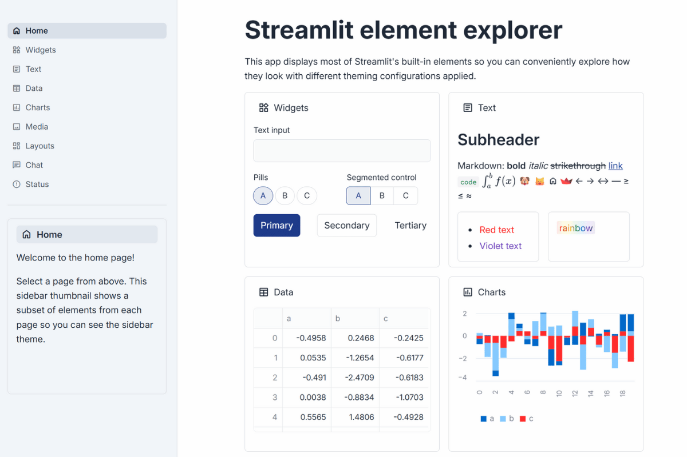

# 💰 Financial Professional Theme

**Corporate-grade design for serious business applications!**

When your data needs to look boardroom-ready and your dashboards require enterprise credibility, this is your theme. Professional, trustworthy, and sophisticated - perfect for financial institutions and corporate environments! 📊✨



## 🔥 What Makes This Theme Special

This theme exudes the authority and trustworthiness of top-tier financial institutions:

**🔷 Deep Navy Primary** (#1e3a8a) - Conveys trust, stability, and authority  
**📊 Charcoal Text** (#1f2937) - Serious, readable, professional contrast  
**🏢 Sophisticated Grays** - Subtle backgrounds that don't distract from data  
**⚖️ Conservative Design** - Clean lines, subtle rounding, serious aesthetics  
**💰 Enterprise Typography** - Inter is used by major financial institutions  
**🎯 High Contrast** - Meets enterprise accessibility standards

## 🎯 Perfect For

- **Financial dashboards** and trading platforms
- **Corporate reporting** and executive briefings
- **Risk assessment tools** and compliance monitoring
- **Investment portfolio** management interfaces
- **Banking applications** and fintech platforms
- **Insurance dashboards** and actuarial tools
- **Accounting software** and financial planning tools
- **Management consulting** presentations and analysis

## 🚀 Quick Start

```bash
# Clone the entire repo to see all themes
git clone https://github.com/jmedia65/awesome-streamlit-themes.git
cd awesome-streamlit-themes

# Install dependencies
pip install -r requirements.txt

# Navigate to financial theme and see it in action
cd financial
streamlit run streamlit_app.py
```

**Love what you see?** Copy the theme to your project:

```bash
# Copy theme files to your Streamlit project
cp -r .streamlit/ /path/to/your/project/
cp -r static/ /path/to/your/project/
```

## 🛠️ Fonts Used

_All fonts are already included in the `static/` folder - no downloads needed!_

### Inter (Enterprise Standard)

- **Perfect for:** Professional typography trusted by financial institutions worldwide
- **Used for:** Body text, headings, interface elements
- **Source:** [Google Fonts - Inter](https://fonts.google.com/specimen/Inter)

### Source Code Pro (Corporate Monospace)

- **Perfect for:** Professional, banking-grade monospace typography
- **Used for:** Financial data, code snippets, precise numbers
- **Source:** [Google Fonts - Source Code Pro](https://fonts.google.com/specimen/Source+Code+Pro)

## 📁 Installation Steps

1. **Clone and explore** the theme first (see Quick Start above)
2. **Copy theme files** to your own Streamlit project:
   ```
   your-project/
   ├── .streamlit/
   │   └── config.toml          # ← Copy this!
   ├── static/                  # ← Copy this entire folder!
   │   ├── Inter_18pt-Regular.ttf
   │   ├── Inter_18pt-Medium.ttf
   │   ├── Inter_18pt-SemiBold.ttf
   │   ├── Inter_18pt-Bold.ttf
   │   ├── SourceCodePro-Regular.ttf
   │   └── SourceCodePro-SemiBold.ttf
   └── your_app.py
   ```
3. **Restart your Streamlit app** and enjoy the corporate credibility!

## 🎨 Theme Configuration

The magic happens in `.streamlit/config.toml`:

```toml
[theme]
primaryColor = "#1e3a8a"              # Deep navy blue - trust, stability, authority
backgroundColor = "#fefefe"            # Off-white - softer than pure white
secondaryBackgroundColor = "#f8fafc"   # Very light gray - subtle distinction
textColor = "#1f2937"                  # Charcoal gray - highly readable
linkColor = "#1e40af"                  # Slightly lighter navy for links
borderColor = "#d1d5db"                # Medium gray borders - clear definition
```

## 🏆 The Enterprise Recognition Factor

This theme creates the same visual confidence you get from premium financial software like Bloomberg Terminal, Goldman Sachs internal tools, or specialized banking platforms.

It says "This is professional financial software you can trust with critical business data."

Perfect for:

- **C-Suite presentations** - Executive-level polish
- **Client-facing tools** - Builds immediate trust
- **Regulatory compliance** - Serious, professional appearance
- **Financial modeling** - Clean, distraction-free environment

## 💡 Why Financial Styling Works

✅ **Instant Credibility** - Navy blue = financial trust worldwide  
✅ **Executive Appeal** - Boardroom-ready aesthetics  
✅ **Data Focus** - Clean design that highlights insights  
✅ **Professional Polish** - Enterprise-grade visual quality  
✅ **Risk Mitigation** - Conservative design reduces user resistance

## 🎯 Pro Tips

- **Perfect for client presentations** - builds immediate confidence
- **Great for regulatory environments** - serious, compliant appearance
- **Ideal for financial data** - high contrast supports precise reading
- **Excellent for executive dashboards** - sophisticated without being flashy

## 🏦 Financial Industry Approved

This color palette and typography combination is trusted by:

- Major banks and financial institutions
- Investment management firms
- Insurance companies
- Accounting and consulting firms
- Government financial agencies

---

**Built with 💼 for applications that handle serious business**  
_Where trust, credibility, and professionalism matter most_ 📈
