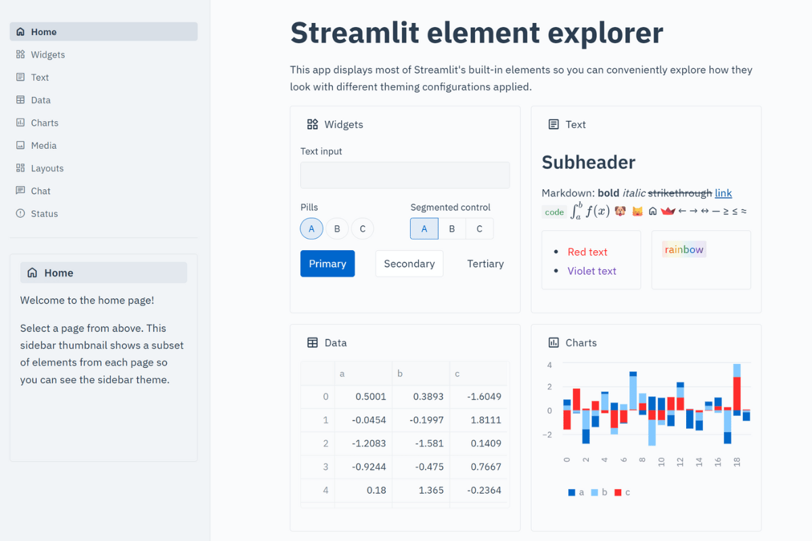

# 🏥 Healthcare Theme

**Clinical-grade design for medical and healthcare applications!**

When patient data and medical insights need professional presentation, this theme delivers the trust and accessibility required for healthcare environments. Clean, clinical, and credible - perfect for medical institutions and healthcare technology! 🩺✨



## 🔥 What Makes This Theme Special

This theme embodies the professionalism and trustworthiness essential for healthcare applications:

**💙 Medical Blue Primary** (#0066cc) - The universal color of healthcare trust  
**🧼 Clinical White Background** - Clean, sterile, professional atmosphere  
**📊 High Contrast Text** - Meets accessibility standards for medical software  
**🔲 Minimal Rounding** - Sharp, precise edges like medical equipment  
**⚕️ IBM Plex Typography** - Used by major healthcare institutions  
**🩹 Soft Borders** - Gentle definition without being harsh

## 🎯 Perfect For

- **Electronic Health Records (EHR)** dashboards and interfaces
- **Medical research** data analysis and visualization
- **Hospital management** systems and operational tools
- **Telemedicine platforms** and patient portals
- **Clinical trial reporting** and pharmaceutical research
- **Patient monitoring** dashboards and real-time data
- **Medical billing** and insurance management tools
- **Public health** analytics and epidemiological studies

## 🚀 Quick Start

```bash
# Clone the entire repo to see all themes
git clone https://github.com/jmedia65/awesome-streamlit-themes.git
cd awesome-streamlit-themes/healthcare

# Install dependencies and see the theme in action
pip install -r requirements.txt
streamlit run streamlit_app.py
```

**Love what you see?** Copy the theme to your project:

```bash
# Copy theme files to your Streamlit project
cp -r .streamlit/ /path/to/your/project/
cp -r static/ /path/to/your/project/
```

## 🛠️ Fonts Used

_All fonts are already included in the `static/` folder - no downloads needed!_

### IBM Plex Sans (Healthcare Industry Standard)

- **Perfect for:** Enterprise healthcare systems and medical interfaces
- **Used for:** Body text, headings, patient information displays
- **Source:** [Google Fonts - IBM Plex Sans](https://fonts.google.com/specimen/IBM+Plex+Sans)

### IBM Plex Mono (Clinical Precision)

- **Perfect for:** Medical data, patient records, precise clinical information
- **Used for:** Code snippets, data tables, medical ID numbers
- **Source:** [Google Fonts - IBM Plex Mono](https://fonts.google.com/specimen/IBM+Plex+Mono)

## 📁 Installation Steps

1. **Clone and explore** the theme first (see Quick Start above)
2. **Copy theme files** to your own Streamlit project:
   ```
   your-project/
   ├── .streamlit/
   │   └── config.toml          # ← Copy this!
   ├── static/                  # ← Copy this entire folder!
   │   ├── IBMPlexSans-Regular.ttf
   │   ├── IBMPlexSans-Medium.ttf
   │   ├── IBMPlexSans-SemiBold.ttf
   │   ├── IBMPlexSans-Bold.ttf
   │   ├── IBMPlexMono-Regular.ttf
   │   └── IBMPlexMono-SemiBold.ttf
   └── your_app.py
   ```
3. **Restart your Streamlit app** and enjoy the clinical professionalism!

## 🎨 Theme Configuration

The magic happens in `.streamlit/config.toml`:

```toml
[theme]
primaryColor = "#0066cc"              # Medical blue - trust, reliability, clinical
backgroundColor = "#fafbfc"           # Off-white - clinical clean but not harsh
secondaryBackgroundColor = "#f4f6f8"  # Light gray-blue - subtle medical feel
textColor = "#2c3e50"                 # Dark blue-gray - highly readable
linkColor = "#0052a3"                 # Darker medical blue for links
borderColor = "#dee2e6"               # Soft gray borders - clean definition
```

## 🏆 The Medical-Grade Difference

This theme creates the same visual confidence you get from premium medical software like Epic, Cerner, or specialized medical devices. It says "This is professional medical software you can trust with critical health data."

Perfect for:

- **Patient safety applications** - Clinical precision and clarity
- **Medical research platforms** - Academic credibility and professionalism
- **Healthcare compliance tools** - Meets medical software visual standards
- **Clinical decision support** - Clean, distraction-free environment

## 💡 Why Healthcare Design Matters

✅ **Patient Trust** - Medical blue builds immediate confidence  
✅ **Clinical Clarity** - High contrast supports accurate data reading  
✅ **Accessibility First** - Meets medical software accessibility standards  
✅ **Professional Credibility** - Visual language of trusted medical institutions  
✅ **Stress Reduction** - Calming colors reduce patient and staff anxiety  
✅ **Regulatory Compliance** - Conservative design supports healthcare regulations

## 🎯 Pro Tips

- **Perfect for patient-facing tools** - builds immediate medical trust
- **Great for clinical workflows** - familiar to healthcare professionals
- **Ideal for medical data visualization** - clean background highlights insights
- **Excellent for telehealth platforms** - professional yet approachable

## ⚕️ Healthcare Industry Trusted

This design approach is used by:

- Major hospital systems and medical centers
- Electronic Health Record (EHR) providers
- Medical device manufacturers
- Pharmaceutical and biotech companies
- Public health organizations

---

**Built with ⚕️ for applications that save lives**  
_Where patient trust and clinical precision matter most_ 🏥
