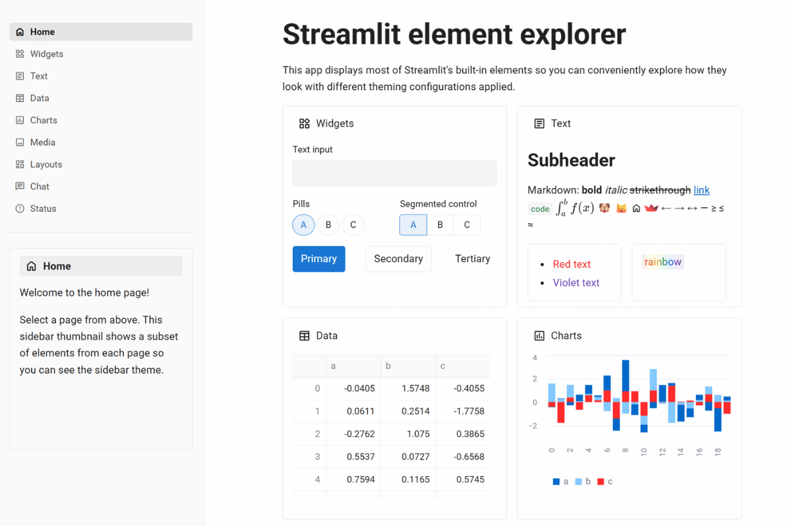

# 📱 Material Design Theme

**Google's systematic design language - now for Streamlit!**

Instantly recognizable, beautifully systematic, and universally trusted. This theme brings Google's Material Design principles to your Streamlit apps, making them feel like applications built with Google's design system! 🎨✨


_Recommended screenshot size: 1200x800px_

## 🔥 What Makes This Theme Special

This theme implements Google's Material Design principles and color system:

**🔵 Material Blue-700** (#1976d2) - From Google's Material Design color palette  
**🏗️ Material Design Gray Scale** - Uses Material Design's defined color tokens  
**📏 4dp Border Radius** (0.25rem) - Follows Material Design's 4dp grid system  
**📱 Roboto Typography** - Material Design's recommended typeface  
**🎯 Elevation Principles** - Subtle background variations following Material guidelines  
**🧩 Material Components Feel** - Designed to feel familiar to Material Design users

## 🎯 Perfect For

- **Consumer-facing dashboards** and analytics platforms
- **Data visualization tools** that need approachable design
- **Admin panels** and management interfaces
- **Educational platforms** and learning management systems
- **Customer support interfaces** and help desk tools
- **Mobile-responsive applications** that work on any device
- **Applications targeting Android users** who know Material Design
- **Any app that needs** systematic, familiar design patterns

## 🚀 Quick Start

```bash
# Clone the entire repo to see all themes
git clone https://github.com/jmedia65/awesome-streamlit-themes.git
cd awesome-streamlit-themes

# Install dependencies
pip install -r requirements.txt

# Navigate to material-design theme and see it in action
cd material-design
streamlit run streamlit_app.py
```

**Love what you see?** Copy the theme to your project:

```bash
# Copy theme files to your Streamlit project
cp -r .streamlit/ /path/to/your/project/
cp -r static/ /path/to/your/project/
```

## 🛠️ Fonts Used

_All fonts are already included in the `static/` folder - no downloads needed!_

### Roboto (Material Design Standard)

- **Perfect for:** Typography following Material Design guidelines
- **Used for:** Body text, headings, interface elements
- **Source:** [Google Fonts - Roboto](https://fonts.google.com/specimen/Roboto)

### Roboto Mono (Material Design Monospace)

- **Perfect for:** Monospace typography within Material Design systems
- **Used for:** Code snippets, data tables, monospace text
- **Source:** [Google Fonts - Roboto Mono](https://fonts.google.com/specimen/Roboto+Mono)

## 📁 Installation Steps

1. **Clone and explore** the theme first (see Quick Start above)
2. **Copy theme files** to your own Streamlit project:
   ```
   your-project/
   ├── .streamlit/
   │   └── config.toml          # ← Copy this!
   ├── static/                  # ← Copy this entire folder!
   │   ├── Roboto-Regular.ttf
   │   ├── Roboto-Medium.ttf
   │   ├── Roboto-Bold.ttf
   │   ├── RobotoMono-Regular.ttf
   │   ├── RobotoMono-Medium.ttf
   │   └── RobotoMono-Bold.ttf
   └── your_app.py
   ```
3. **Restart your Streamlit app** and enjoy the Material Design implementation!

## 🎨 Theme Configuration

The implementation happens in `.streamlit/config.toml`:

```toml
[theme]
primaryColor = "#1976d2"              # Material Blue-700 from Material palette
backgroundColor = "#ffffff"           # Material Design surface color
secondaryBackgroundColor = "#f5f5f5"  # Material Grey-100 for elevation
textColor = "#212121"                 # Material Grey-900 for high contrast
linkColor = "#1565c0"                 # Material Blue-800 for links
borderColor = "#e0e0e0"               # Material Grey-300 for dividers
```

## 🏆 The Material Design Recognition Factor

This theme implements Material Design principles that billions of users recognize from Android devices and Google's web applications. Users familiar with Material Design will find the interface patterns intuitive and trustworthy.

Perfect balance of:

- **Professional enough** for enterprise applications
- **Approachable enough** for consumer-facing tools
- **Systematic enough** for complex data interfaces
- **Familiar enough** for users of Android and Material Design apps

## 💡 Why Material Design Implementation Works

✅ **Widespread Recognition** - Material Design is used across Android and many web applications  
✅ **Systematic Approach** - Based on Google's documented design principles  
✅ **Accessibility Considerations** - Material Design includes accessibility guidelines  
✅ **Mobile-Responsive Principles** - Designed with touch interfaces in mind  
✅ **Consistent Patterns** - Users can transfer knowledge from other Material Design apps  
✅ **Well-Documented** - Based on Google's publicly available design system

## 🎯 Pro Tips

- **Perfect for B2C applications** that benefit from familiar design patterns
- **Great for Android-focused projects** where users expect Material Design
- **Ideal for systematic design needs** where consistency matters
- **Excellent for international applications** targeting mobile-first markets

---

**Built with 📱 following Material Design principles**  
_Implementing Google's design system for Streamlit applications_ 🎨
