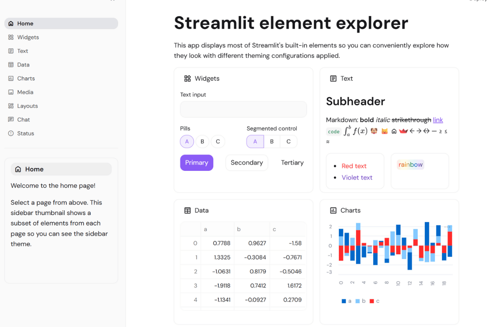

# 🚀 SaaS/Startup Theme

**Modern, growth-focused design for unicorn-level internal tools!**

When your internal dashboards need to match the energy and polish of billion-dollar startups, this theme delivers. Think Stripe meets Linear meets Vercel - sophisticated, trendy, and built for growth. Perfect for making every internal tool feel like it belongs in Silicon Valley! 💜✨



## 🔥 What Makes This Theme Special

This theme captures the visual DNA of today's most successful startups and SaaS companies:

**💜 Modern Purple Primary** (#8b5cf6) - The color of innovation, growth, and startup energy  
**✨ Generous Border Radius** (0.75rem) - Friendly, modern, approachable interface design  
**🎯 DM Sans Typography** - The font that screams "we raised Series A"  
**⚡ Clean Contrast** - High-performance readability for data-heavy dashboards  
**🔮 Developer-First Code Font** - Fira Code with beautiful ligatures  
**🌟 Startup-Grade Spacing** - Modern, breathable, energetic layout

## 🎯 Perfect For

- **Internal analytics dashboards** and growth metrics platforms
- **Customer success tools** and user engagement tracking
- **A/B testing interfaces** and experiment management
- **Revenue tracking systems** and financial KPI dashboards
- **Product usage analytics** and user behavior insights
- **Team performance tools** and productivity metrics
- **Marketing automation** dashboards and campaign analysis
- **Sales pipeline management** and conversion tracking

## 🚀 Quick Start

```bash
# Clone the entire repo to see all themes
git clone https://github.com/jmedia65/awesome-streamlit-themes.git
cd awesome-streamlit-themes/saas-startup

# Install dependencies and see the theme in action
pip install -r requirements.txt
streamlit run streamlit_app.py
```

**Love what you see?** Copy the theme to your project:

```bash
# Copy theme files to your Streamlit project
cp -r .streamlit/ /path/to/your/project/
cp -r static/ /path/to/your/project/
```

## 🛠️ Fonts Used

_All fonts are already included in the `static/` folder - no downloads needed!_

### DM Sans (Startup World's Darling)

- **Perfect for:** Modern startup interfaces used by Stripe, GitHub, Linear, and unicorns
- **Used for:** Body text, headings, interface elements
- **Source:** [Google Fonts - DM Sans](https://fonts.google.com/specimen/DM+Sans)

### Fira Code (Developer's Dream)

- **Perfect for:** Beautiful ligatures and modern monospace magic for technical teams
- **Used for:** Code snippets, technical data, developer-focused content
- **Source:** [Google Fonts - Fira Code](https://fonts.google.com/specimen/Fira+Code)

## 📁 Installation Steps

1. **Clone and explore** the theme first (see Quick Start above)
2. **Copy theme files** to your own Streamlit project:
   ```
   your-project/
   ├── .streamlit/
   │   └── config.toml          # ← Copy this!
   ├── static/                  # ← Copy this entire folder!
   │   ├── DMSans-Regular.ttf
   │   ├── DMSans-Medium.ttf
   │   ├── DMSans-SemiBold.ttf
   │   ├── DMSans-Bold.ttf
   │   ├── FiraCode-Regular.ttf
   │   └── FiraCode-Medium.ttf
   └── your_app.py
   ```
3. **Restart your Streamlit app** and enjoy the unicorn energy!

## 🎨 Theme Configuration

The magic happens in `.streamlit/config.toml`:

```toml
[theme]
primaryColor = "#8b5cf6"              # Purple-500 - modern, trendy, growth-focused
backgroundColor = "#ffffff"           # Pure white - clean, modern foundation
secondaryBackgroundColor = "#fafafa"  # Neutral-50 - subtle modern gray
textColor = "#18181b"                 # Zinc-900 - high contrast, modern
linkColor = "#7c3aed"                 # Purple-600 - slightly darker for links
borderColor = "#e4e4e7"               # Zinc-200 - clean, modern borders
```

## 🏆 The Unicorn Factor

This theme makes any Streamlit app look like it belongs in a $10B startup's internal tool suite. It has that perfect balance of:

- **Professional enough** for board presentations
- **Modern enough** for Gen Z developers
- **Trendy enough** for Silicon Valley standards
- **Clean enough** for data-heavy interfaces

Your colleagues will ask: "Wait, is this actually Streamlit?!" 🤯

## 💡 Why Startup Styling Works

✅ **Growth Mindset** - Purple conveys innovation and forward-thinking  
✅ **Modern Aesthetics** - Generous rounding feels current and friendly  
✅ **Developer Appeal** - Typography choices resonate with technical teams  
✅ **Investor Ready** - Professional enough for funding presentations  
✅ **Team Adoption** - Modern design increases internal tool usage  
✅ **Scalability** - Looks good from MVP to IPO

## 🎯 Pro Tips

- **Perfect for growth teams** - makes metrics dashboards feel exciting
- **Great for internal hackathons** - inspiring and energetic interface
- **Ideal for customer success** - modern, approachable for client-facing tools
- **Excellent for product analytics** - clean background highlights user insights

## 🦄 Startup Approved

This design aesthetic is used by unicorns like:

- Stripe (payments and financial tools)
- Linear (project management and development)
- Vercel (deployment and hosting platforms)
- GitHub (code collaboration interfaces)
- Figma (design and creative tools)

---

**Built with 🦄 for teams that think big**  
_Making internal tools as beautiful as the products you ship_ 🚀
