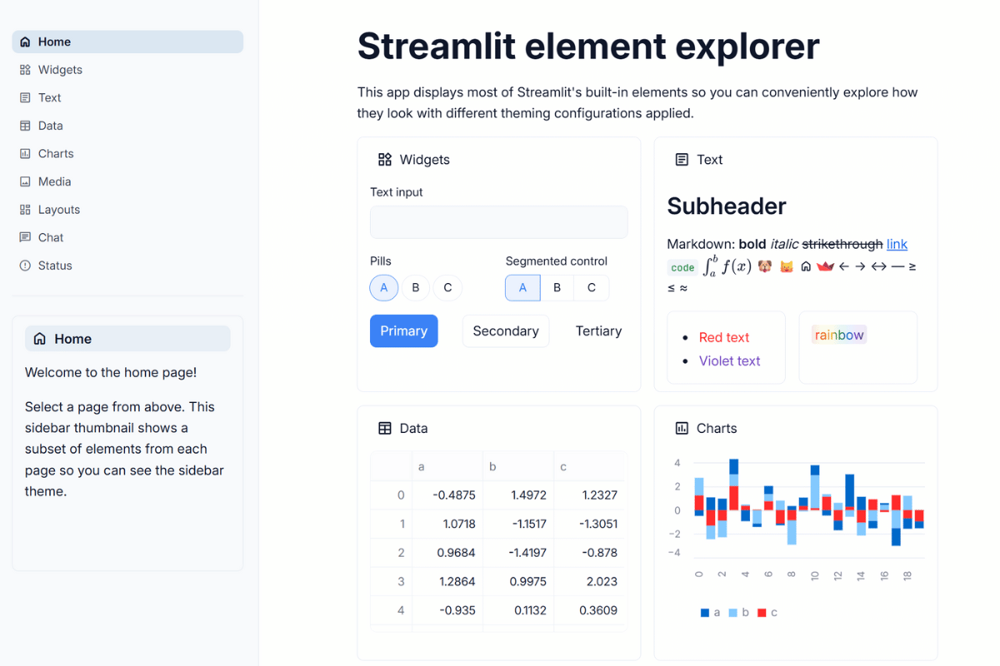

# 🎯 Tailwind-Inspired Theme

**Modern web standards that many developers recognize!**

Inspired by the popular utility-first CSS framework - now for Streamlit! Clean, systematic, and familiar to developers who use Tailwind CSS. This theme brings Tailwind-inspired design principles to your data applications with that modern web app aesthetic! 🌊✨



## 🔥 What Makes This Theme Special

This theme captures the clean, systematic design principles inspired by Tailwind CSS:

**🔵 Tailwind-Inspired Blue** (#3b82f6) - Blue-500 from Tailwind's color palette  
**📱 System-Like Feel** - Clean, familiar, professional web application aesthetic  
**⚙️ Modern Border Radius** (0.5rem) - Consistent with Tailwind's design system  
**📊 Tailwind-Inspired Gray Scale** - Using Tailwind's slate palette colors  
**🎯 Modern Typography** - Inter font for contemporary web application feel  
**🧩 Component-Ready** - Designed to feel like modern web applications

## 🎯 Perfect For

- **Internal business tools** and administrative dashboards
- **Data analysis platforms** that need web app credibility
- **Developer tools** and technical interfaces
- **Customer support systems** and help desk platforms
- **Project management** and team collaboration tools
- **E-commerce analytics** and business intelligence dashboards
- **Educational platforms** and learning management systems
- **Applications needing** modern web application aesthetics

## 🚀 Quick Start

```bash
# Clone the entire repo to see all themes
git clone https://github.com/jmedia65/awesome-streamlit-themes.git
cd awesome-streamlit-themes

# Install dependencies
pip install -r requirements.txt

# Navigate to tailwind theme and see it in action
cd tailwind
streamlit run streamlit_app.py
```

**Love what you see?** Copy the theme to your project:

```bash
# Copy theme files to your Streamlit project
cp -r .streamlit/ /path/to/your/project/
cp -r static/ /path/to/your/project/
```

## 🛠️ Fonts Used

_All fonts are already included in the `static/` folder - no downloads needed!_

### Inter (Modern Web Typography)

- **Perfect for:** Clean, web-optimized typography popular in modern web applications
- **Used for:** Body text, headings, interface elements
- **Source:** [Google Fonts - Inter](https://fonts.google.com/specimen/Inter)

### JetBrains Mono (Developer-Friendly Monospace)

- **Perfect for:** Clean, modern monospace preferred by many developers
- **Used for:** Code snippets, technical data, developer content
- **Source:** [Google Fonts - JetBrains Mono](https://fonts.google.com/specimen/JetBrains+Mono)

## 📁 Installation Steps

1. **Clone and explore** the theme first (see Quick Start above)
2. **Copy theme files** to your own Streamlit project:
   ```
   your-project/
   ├── .streamlit/
   │   └── config.toml          # ← Copy this!
   ├── static/                  # ← Copy this entire folder!
   │   ├── Inter_18pt-Regular.ttf
   │   ├── Inter_18pt-Medium.ttf
   │   ├── Inter_18pt-SemiBold.ttf
   │   ├── Inter_18pt-Bold.ttf
   │   ├── JetBrainsMono-Regular.ttf
   │   └── JetBrainsMono-Medium.ttf
   └── your_app.py
   ```
3. **Restart your Streamlit app** and enjoy the modern web feel!

## 🎨 Theme Configuration

The implementation happens in `.streamlit/config.toml`:

```toml
[theme]
primaryColor = "#3b82f6"           # Tailwind blue-500 - clean, modern primary
backgroundColor = "#ffffff"        # Pure white background
secondaryBackgroundColor = "#f8fafc" # Tailwind slate-50 - subtle gray
textColor = "#0f172a"             # Tailwind slate-900 - dark, readable
linkColor = "#2563eb"             # Tailwind blue-600 - slightly darker blue
borderColor = "#e2e8f0"           # Tailwind slate-200 - light, clean borders
```

## 🏆 The Developer Recognition Factor

Many web developers will recognize this aesthetic and think: "This looks like a professional web application." It has the visual credibility of systematic design - clean, organized, and trustworthy.

This theme bridges the gap between "obviously Streamlit" and "looks like a real web app" by using familiar design patterns from modern web development.

Perfect for:

- **Developer-facing tools** - Familiar patterns and comfortable aesthetics
- **Internal dashboards** - Professional without being intimidating
- **Client presentations** - Modern, systematic, trustworthy appearance
- **Cross-functional teams** - Appeals to both technical and business users

## 💡 Why Tailwind-Inspired Design Works

✅ **Familiar Patterns** - Many developers recognize Tailwind's design approach  
✅ **Modern Web Standards** - Based on contemporary web design principles  
✅ **Systematic Approach** - Consistent color and spacing choices  
✅ **Developer Comfort** - Familiar design patterns reduce cognitive load  
✅ **Professional Credibility** - Systematic design approach builds trust  
✅ **Scalable Design** - Design system thinking that works at any scale

## 🎯 Pro Tips

- **Perfect for technical audiences** - speaks their visual language
- **Great for professional presentations** - looks like a real product
- **Ideal for internal tools** - familiar patterns encourage adoption
- **Excellent for prototypes** - professional enough for stakeholder demos

## 🌊 Modern Web Development Inspired

This design approach is similar to patterns found in:

- Modern SaaS dashboards and admin panels
- Developer tools and API documentation sites
- E-commerce platforms and management interfaces
- Educational technology and learning platforms
- Business intelligence and analytics tools

---

**Built with 🌊 for developers who appreciate clean, systematic design**  
_Bringing Tailwind-inspired design principles to the Streamlit world_ 🎯
