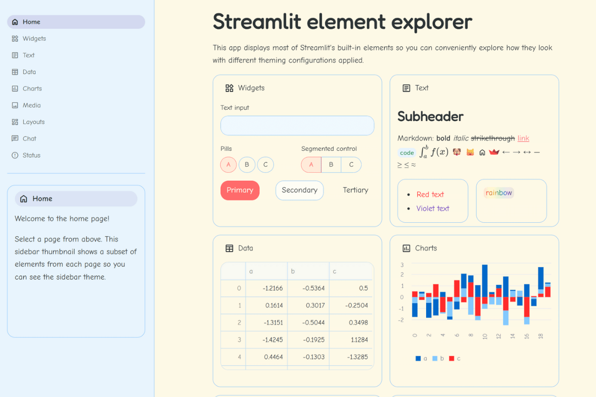

# 🧸 Toddler-Friendly Theme

**The most adorable way to make educational apps that little ones actually want to use!**

When your users are 3-6 years old and attention spans are measured in minutes, every design choice matters. This theme is designed with young children in mind, using colors and typography that feel welcoming and safe. Perfect for educational technology, early learning platforms, and any app where the user might still believe in unicorns! 🌈✨



## 🔥 What Makes This Theme Child-Friendly

This theme is designed with consideration for young users and child-friendly interface principles:

**🍑 Warm Coral Primary** (#ff6b6b) - Friendly red that feels welcoming, not aggressive  
**☀️ Sunshine Background** (#fff9e6) - Soft cream yellow that feels warm and inviting  
**☁️ Cloud Blue Sections** (#f0f8ff) - Light, airy color reminiscent of a clear sky  
**🎈 Extra Rounded Corners** (1rem) - Soft, rounded shapes that feel friendly and safe  
**👶 Child-Friendly Typography** - Comic Neue designed with readability in mind  
**🎪 Playful Pink Links** (#fd79a8) - Fun color that's still readable

## 🎯 Perfect For

- **Educational games** and early learning applications
- **Storytelling apps** and interactive picture books
- **Learning management systems** for preschools and daycares
- **Child development tracking** tools for parents and educators
- **Therapy and assessment** applications for pediatric professionals
- **Family-friendly dashboards** and parental control interfaces
- **EdTech prototypes** targeting early childhood education
- **Research tools** studying child behavior and development

## 🚀 Quick Start

```bash
# Clone the entire repo to see all themes
git clone https://github.com/jmedia65/awesome-streamlit-themes.git
cd awesome-streamlit-themes

# Install dependencies
pip install -r requirements.txt

# Navigate to toddler theme and see it in action
cd toddler
streamlit run streamlit_app.py
```

**Ready to make learning magical?** Copy the theme to your project:

```bash
# Copy theme files to your Streamlit project
cp -r .streamlit/ /path/to/your/project/
cp -r static/ /path/to/your/project/
```

## 🛠️ Fonts Used

_All fonts are already included in the `static/` folder - no downloads needed!_

### Comic Neue (Child-Friendly Reading)

- **Perfect for:** Clear, friendly typography designed with readability in mind
- **Used for:** Body text, instructions, content for young readers
- **Source:** [Google Fonts - Comic Neue](https://fonts.google.com/specimen/Comic+Neue)

### Fredoka One (Playful Headlines)

- **Perfect for:** Bouncy, playful headings that feel fun and engaging
- **Used for:** Headings, titles, attention-grabbing elements
- **Source:** [Google Fonts - Fredoka One](https://fonts.google.com/specimen/Fredoka+One)

### Source Code Pro (Technical Elements)

- **Perfect for:** Monospace font for any technical content
- **Used for:** Technical elements that adults need to see
- **Source:** [Google Fonts - Source Code Pro](https://fonts.google.com/specimen/Source+Code+Pro)

## 📁 Installation Steps

1. **Clone and explore** the theme first (see Quick Start above)
2. **Copy theme files** to your own Streamlit project:
   ```
   your-project/
   ├── .streamlit/
   │   └── config.toml          # ← Copy this child-friendly config!
   ├── static/                  # ← Copy this entire folder!
   │   ├── ComicNeue-Regular.ttf
   │   ├── ComicNeue-Bold.ttf
   │   ├── FredokaOne-Regular.ttf
   │   └── SourceCodePro-Regular.ttf
   └── your_app.py
   ```
3. **Restart your Streamlit app** and enjoy the child-friendly design!

## 🎨 Theme Configuration

The child-friendly design happens in `.streamlit/config.toml`:

```toml
[theme]
primaryColor = "#ff6b6b"              # Warm coral red - friendly and welcoming
backgroundColor = "#fff9e6"           # Soft cream yellow - warm and inviting
secondaryBackgroundColor = "#f0f8ff"  # Alice blue - soft and gentle
textColor = "#2d3436"                 # Soft dark gray - comfortable to read
linkColor = "#fd79a8"                 # Playful pink - fun but readable
borderColor = "#74b9ff"               # Sky blue borders - cheerful and bright
```

## 🏆 The Child-Centered Design Advantage

This theme is designed with young users in mind, incorporating design choices that aim to be:

- **Visually comfortable** with soft colors and rounded shapes
- **Welcoming and friendly** through warm color choices
- **Easy to read** with clear typography and good contrast
- **Approachable** for both children and their parents/educators

Perfect for:

- **Educational technology** that needs to engage young learners
- **Therapy applications** where comfort and approachability matter
- **Parent-facing tools** that need to feel both trustworthy and friendly
- **Research platforms** where creating a comfortable environment is important

## 💡 Why Child-Focused Design Matters

✅ **Visual Comfort** - Soft colors and rounded shapes create a welcoming feel  
✅ **Readability Focus** - Clear typography supports developing reading skills  
✅ **Approachable Design** - Friendly appearance reduces intimidation  
✅ **Parent and Educator Trust** - Professional enough for adults, friendly for children  
✅ **Inclusive Approach** - Design choices consider diverse learning needs  
✅ **Age-Appropriate Aesthetics** - Colors and shapes that appeal to young children

## 🎯 Pro Tips

- **Perfect for EdTech demos** - shows consideration for your youngest users
- **Great for accessibility showcases** - demonstrates inclusive design thinking
- **Ideal for parent-facing tools** - builds trust while staying approachable
- **Excellent for research applications** - creates a comfortable environment for young participants

## 👨‍👩‍👧‍👦 Designed with Children in Mind

This design approach is informed by:

- Early childhood education design practices
- User experience principles for young users
- Accessibility considerations for developing readers
- Feedback from parents and educators working with educational technology
- General principles of child-friendly interface design

## 🎈 Design Philosophy

Every choice in this theme considers the question: "Will this help create a positive experience for young users?" From the warm, inviting colors to the extra-rounded corners that feel soft and safe, this theme prioritizes creating a welcoming environment for children and their families.

## 🤝 Contributing

Found a way to make this theme even better? We'd love to see it! Open an issue or submit a PR.

---

**Built with 💕 for the smallest and most important users**  
_Because good design starts with understanding your audience - even if they're only 3 feet tall_ 🌈
